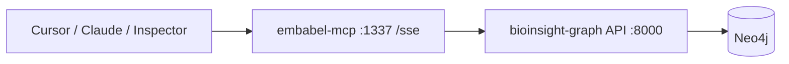
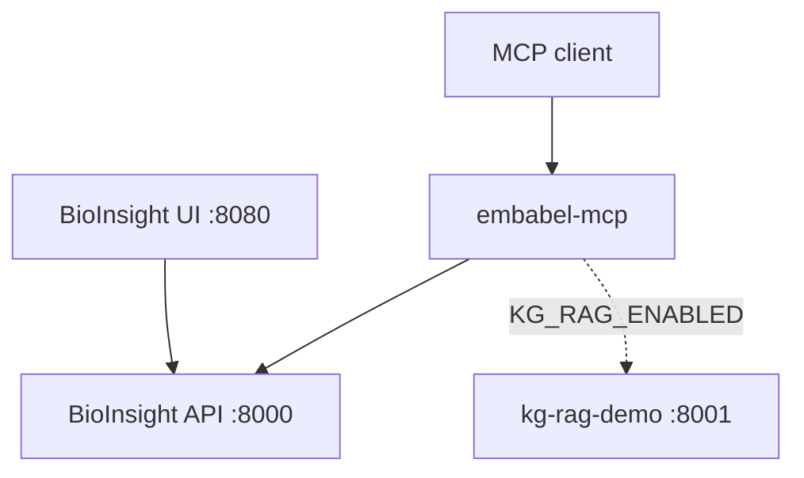

# embabel-mcp

**MCP integration for [BioInsight Graph](https://github.com/LordKay-sudo/bioinsight-graph)** — the disease–target knowledge graph application (Neo4j, FastAPI, React explorer). This repo adds an Embabel MCP server so Cursor, Claude Desktop, and other clients can call the **same** `/api/v1` surface the web UI uses.

BioInsight Graph is the product. embabel-mcp is not a replacement, fork, or “wrapper app” — it is agent tooling built on top of that API.

Built with [Embabel Agent](https://docs.embabel.com/embabel-agent/guide/0.3.1/) (`embabel-agent-starter-mcpserver`).

> **Data notice:** Demo/sample Open Targets–style data only — not for clinical decisions.

## Architecture



### How this fits the BioInsight platform



### BioInsight Graph UI

The primary interface — search, ranked associations, and force-directed graph exploration. Run it at http://localhost:8080 (see [bioinsight-graph](https://github.com/LordKay-sudo/bioinsight-graph)).

| Search | Force-directed graph |
|--------|----------------------|
|  |  |

Full gene detail: [screenshot-gene-detail.png](https://github.com/LordKay-sudo/bioinsight-graph/blob/main/docs/screenshot-gene-detail.png) · Walkthrough: [demo-walkthrough.gif](https://github.com/LordKay-sudo/bioinsight-graph/blob/main/docs/demo-walkthrough.gif)

## Embabel agent (Phase 3)

| MCP export | Description |
|------------|-------------|
| **`research_gene`** | `GeneResearchAgent` — parse symbol → load graph → markdown report + link to web UI |

Starting inputs: `GeneSymbolQuery` (symbol string) or natural language via `UserInput`.

## MCP tools

Most tools accept optional `format`: **`markdown`** (default) or **`json`**.

| Tool | BioInsight API |
|------|----------------|
| `bioinsight_health` | `GET /api/v1/health` |
| `bioinsight_stats` | `GET /api/v1/stats` |
| `search_genes` | `GET /api/v1/genes?q=` |
| `search_diseases` | `GET /api/v1/diseases?q=` |
| `get_gene` | `GET /api/v1/genes/{id}` |
| `get_gene_diseases` | `GET /api/v1/genes/{id}/diseases` (ranked by score) |
| `get_disease` | `GET /api/v1/diseases/{id}` |
| `get_disease_genes` | `GET /api/v1/diseases/{id}/genes` (top targets) |
| `compare_genes` | `GET /api/v1/genes/compare?symbols=BRCA1,TP53` |
| `get_gene_neighbors` | `GET /api/v1/genes/{id}/neighbors` |
| `export_gene_subgraph` | `GET /api/v1/export/subgraph?gene_id=` |
| `build_target_dossier` | Full markdown handoff: detail + diseases + neighbors + stats + provenance + UI link |
| `investigate_gene_symbol` | search + detail + ranked diseases + neighbors (lighter than dossier) |

## MCP resources

| URI | Description |
|-----|-------------|
| `bioinsight://schema` | Graph model + example Cypher |
| `bioinsight://meta` | Live data version, sources, disclaimer (`GET /api/v1/meta`) |
| `bioinsight://provenance` | Dataset scope and link to PROVENANCE.md |
| `bioinsight://stats` | Live counts from the running API |
| `bioinsight://ecosystem` | All browser/API URLs (BioInsight, Neo4j, KG RAG, MCP) |

## MCP prompts

| Prompt | Use case |
|--------|----------|
| `summarize-gene-targets` | Investigate a symbol and summarize associations |
| `compare-gene-pair` | Compare two genes and overlapping diseases |
| `top-targets-for-disease` | Find ranked targets for a disease name |
| `graph-and-literature` | Graph evidence + `kg_rag_ask` when enabled |
| `review-gene-report` | **HITL:** human verifies http://localhost:8080 before trusting report |

## Human-in-the-loop

| Layer | How |
|-------|-----|
| **BioInsight UI** | http://localhost:8080 — visual ground truth |
| **MCP prompt** | `review-gene-report` |
| **Embabel agent** | `BIOINSIGHT_HITL_ENABLED=true` → `WaitFor` approval form (not for default MCP) |

Guide: [docs/HUMAN_IN_THE_LOOP.md](docs/HUMAN_IN_THE_LOOP.md) · MCP resource `bioinsight://human-in-the-loop`

## KG RAG bridge (Phase 4, optional)

Set `KG_RAG_ENABLED=true` and run [kg-rag-demo](https://github.com/LordKay-sudo/kg-rag-demo) on port **8001**:

| Tool | API |
|------|-----|
| `kg_rag_health` | `GET /api/v1/health` |
| `kg_rag_ask` | `POST /api/v1/ask` |

## Example questions

- *“What are the top disease associations for BRCA1?”* → `investigate_gene_symbol` or `get_gene_diseases`
- *“Compare BRCA1 and TP53”* → `compare_genes`
- *“Which genes target breast cancer?”* → `search_diseases` then `get_disease_genes`

## Prerequisites

- **Java 21** and **Maven 3.9+**
- [bioinsight-graph](https://github.com/LordKay-sudo/bioinsight-graph) API running on port **8000** (Neo4j seeded)
- **OPENAI_API_KEY** — required by Embabel at startup ([OpenRouter](https://openrouter.ai/) free models work; see `.env.example`)

## Quick start

### 1. Start BioInsight Graph API

From your bioinsight-graph clone:

```powershell
cd C:\Users\Lordwill\Documents\projects\bioinsight-graph
docker compose up -d neo4j
# seed once if needed — see bioinsight-graph README
cd api
py -3 -m venv .venv
.\.venv\Scripts\pip install -r requirements.txt
.\.venv\Scripts\uvicorn app.main:app --reload --port 8000
```

Verify: http://localhost:8000/api/v1/health

### 2. Configure and run MCP server

```powershell
cd C:\Users\Lordwill\Documents\projects\embabel-mcp
copy .env.example .env
# Edit .env — set OPENAI_API_KEY (OpenRouter key is fine)

$env:OPENAI_API_KEY = "your-key"
$env:OPENAI_BASE_URL = "https://openrouter.ai"
$env:BIOINSIGHT_API_BASE_URL = "http://localhost:8000/api/v1"

mvn spring-boot:run
```

SSE endpoint: **http://localhost:1337/sse**

### 3. Connect Cursor

Merge into `.cursor/mcp.json` (see `cursor-mcp.example.json`):

```json
{
  "mcpServers": {
    "bioinsight-graph": {
      "command": "npx",
      "args": ["-y", "mcp-remote", "http://localhost:1337/sse"]
    }
  }
}
```

### 4. Test with MCP Inspector

```bash
npx @modelcontextprotocol/inspector
```

Connect to `http://localhost:1337/sse`, then try `compare_genes` with `symbols=BRCA1,TP53` or open prompt `summarize-gene-targets`.

## Context budget

Large MCP servers inflate the IDE context window; the **120k-token limit is on the host model**, not per tool. This repo defaults to **full-fidelity responses** (no truncation):

- **`BIOINSIGHT_MCP_TOOL_PROFILE`** — `minimal` / `standard` / `full` (main lever)
- **`BIOINSIGHT_MCP_COMPACT_MODE`** — `off` (default), `warn`, or opt-in `truncate`
- Workflow dossiers are **never truncated**; optional advisory footer only

See [docs/CONTEXT_BUDGET.md](docs/CONTEXT_BUDGET.md) and [docs/RESPONSE_POLICY.md](docs/RESPONSE_POLICY.md). MCP resource: `bioinsight://context-policy`.

## Configuration

| Variable | Default | Description |
|----------|---------|-------------|
| `BIOINSIGHT_API_BASE_URL` | `http://localhost:8000/api/v1` | FastAPI base URL |
| `BIOINSIGHT_WEB_UI_URL` | `http://localhost:8080` | Deep links in markdown dossiers |
| `BIOINSIGHT_MCP_TOOL_PROFILE` | `standard` | `minimal` \| `standard` \| `full` — tools exposed at startup |
| `BIOINSIGHT_MCP_COMPACT_MODE` | `off` | `off` \| `warn` \| `truncate` (truncate not recommended) |
| `BIOINSIGHT_MCP_MAX_RESPONSE_CHARS` | `0` | Hard cap only when `compact-mode=truncate` |
| `BIOINSIGHT_MCP_WARN_RESPONSE_CHARS` | `12000` | Advisory footer threshold (chars); does not cut content |
| `MCP_SERVER_PORT` | `1337` | HTTP port for SSE |
| `OPENAI_API_KEY` | — | Required (OpenAI or OpenRouter) |
| `OPENAI_BASE_URL` | `https://openrouter.ai` | OpenAI-compatible API base |
| `EMBABEL_DEFAULT_LLM` | `x-ai/grok-4.1-fast:free` | Default model id |
| `KG_RAG_ENABLED` | `false` | Enable kg-rag-demo tools |
| `KG_RAG_API_BASE_URL` | `http://localhost:8001/api/v1` | KG RAG FastAPI base |

## Docker

### Full stack (with bioinsight-graph)

Clone both repos side by side, add `OPENAI_API_KEY` to bioinsight-graph `.env`, then:

```bash
cd bioinsight-graph
docker compose -f docker-compose.yml -f docker-compose.mcp.yml up --build
```

| Service | URL |
|---------|-----|
| MCP (SSE) | http://localhost:1337/sse |
| BioInsight Web UI | http://localhost:8080 |
| API | http://localhost:8000/docs |

### MCP only (API already on :8000)

```bash
cd embabel-mcp
copy .env.example .env
# set OPENAI_API_KEY
docker compose up --build
```

Or a single image:

```bash
docker build -t embabel-mcp .
docker run --rm -p 1337:1337 \
  -e OPENAI_API_KEY \
  -e BIOINSIGHT_API_BASE_URL=http://host.docker.internal:8000/api/v1 \
  embabel-mcp
```

## Documentation

| Doc | Topic |
|-----|--------|
| [docs/ROADMAP.md](docs/ROADMAP.md) | Implementation tasks (M1–M13) |
| [docs/USE_CASES.md](docs/USE_CASES.md) | Worked examples |
| [docs/RESPONSE_POLICY.md](docs/RESPONSE_POLICY.md) | When compaction runs; workflow exemption; config |
| [docs/CONTEXT_BUDGET.md](docs/CONTEXT_BUDGET.md) | Characters vs tokens; staying under host 120k |
| [docs/HUMAN_IN_THE_LOOP.md](docs/HUMAN_IN_THE_LOOP.md) | Review workflows |
| [ECOSYSTEM_CONTEXT](https://github.com/LordKay-sudo/bioinsight-graph/blob/main/docs/ECOSYSTEM_CONTEXT.md) | Compact handoff for new agent sessions |

## Development

```bash
mvn test
mvn spring-boot:run
```

## Related repos

- [bioinsight-graph](https://github.com/LordKay-sudo/bioinsight-graph) — Neo4j graph, FastAPI, React UI
- [Portfolio roadmap](https://github.com/LordKay-sudo/bioinsight-graph/blob/main/docs/PORTFOLIO_ROADMAP.md) — cross-repo plan · [kg-rag ROADMAP](https://github.com/LordKay-sudo/kg-rag-demo/blob/main/docs/ROADMAP.md)
- [kg-rag-demo](https://github.com/LordKay-sudo/kg-rag-demo) — optional document RAG (`KG_RAG_ENABLED=true`)

## License

MIT © 2026 [LordKay-sudo](https://github.com/LordKay-sudo)
