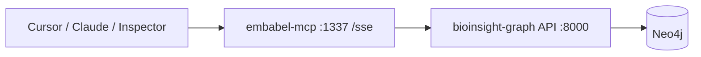

# embabel-mcp

**MCP server** for [BioInsight Graph](https://github.com/LordKay-sudo/bioinsight-graph) — exposes the disease–target knowledge graph API as [Model Context Protocol](https://modelcontextprotocol.io/) tools for Cursor, Claude Desktop, and other MCP clients.

Built with [Embabel Agent](https://docs.embabel.com/embabel-agent/guide/0.3.1/) (`embabel-agent-starter-mcpserver`). Tools proxy the existing FastAPI service; Neo4j and Cypher stay in bioinsight-graph.

> **Data notice:** Demo/sample Open Targets–style data only — not for clinical decisions.

## Architecture



## MCP tools

| Tool | BioInsight API |
|------|----------------|
| `bioinsight_health` | `GET /api/v1/health` |
| `bioinsight_stats` | `GET /api/v1/stats` |
| `search_genes` | `GET /api/v1/genes?q=` |
| `search_diseases` | `GET /api/v1/diseases?q=` |
| `get_gene` | `GET /api/v1/genes/{id}` |
| `get_gene_neighbors` | `GET /api/v1/genes/{id}/neighbors` |
| `export_gene_subgraph` | `GET /api/v1/export/subgraph?gene_id=` |
| `investigate_gene_symbol` | search + detail + neighbors (composite) |

## Prerequisites

- **Java 21** and **Maven 3.9+**
- [bioinsight-graph](https://github.com/LordKay-sudo/bioinsight-graph) API running on port **8000** (Neo4j seeded)
- **OPENAI_API_KEY** — required by Embabel at startup ([OpenRouter](https://openrouter.ai/) free models work; see `.env.example`)

## Quick start

### 1. Start BioInsight Graph API

From your bioinsight-graph clone:

```powershell
cd C:\Users\Lordwill\Documents\projects\bioinsight-graph
docker compose up -d neo4j
# seed once if needed — see bioinsight-graph README
cd api
py -3 -m venv .venv
.\.venv\Scripts\pip install -r requirements.txt
.\.venv\Scripts\uvicorn app.main:app --reload --port 8000
```

Verify: http://localhost:8000/api/v1/health

### 2. Configure and run MCP server

```powershell
cd C:\Users\Lordwill\Documents\projects\embabel-mcp
copy .env.example .env
# Edit .env — set OPENAI_API_KEY (OpenRouter key is fine)

$env:OPENAI_API_KEY = "your-key"
$env:OPENAI_BASE_URL = "https://openrouter.ai"
$env:BIOINSIGHT_API_BASE_URL = "http://localhost:8000/api/v1"

mvn spring-boot:run
```

SSE endpoint: **http://localhost:1337/sse**

### 3. Connect Cursor

Merge into `.cursor/mcp.json` (see `cursor-mcp.example.json`):

```json
{
  "mcpServers": {
    "bioinsight-graph": {
      "command": "npx",
      "args": ["-y", "mcp-remote", "http://localhost:1337/sse"]
    }
  }
}
```

### 4. Test with MCP Inspector

```bash
npx @modelcontextprotocol/inspector
```

Connect to `http://localhost:1337/sse`, then call `bioinsight_stats` or `search_genes` with `query=BRCA1`.

## Configuration

| Variable | Default | Description |
|----------|---------|-------------|
| `BIOINSIGHT_API_BASE_URL` | `http://localhost:8000/api/v1` | FastAPI base URL |
| `MCP_SERVER_PORT` | `1337` | HTTP port for SSE |
| `OPENAI_API_KEY` | — | Required (OpenAI or OpenRouter) |
| `OPENAI_BASE_URL` | `https://openrouter.ai` | OpenAI-compatible API base |
| `EMBABEL_DEFAULT_LLM` | `x-ai/grok-4.1-fast:free` | Default model id |

## Docker

### Full stack (with bioinsight-graph)

Clone both repos side by side, add `OPENAI_API_KEY` to bioinsight-graph `.env`, then:

```bash
cd bioinsight-graph
docker compose -f docker-compose.yml -f docker-compose.mcp.yml up --build
```

| Service | URL |
|---------|-----|
| MCP (SSE) | http://localhost:1337/sse |
| API | http://localhost:8000/docs |

### MCP only (API already on :8000)

```bash
cd embabel-mcp
copy .env.example .env
# set OPENAI_API_KEY
docker compose up --build
```

Or a single image:

```bash
docker build -t embabel-mcp .
docker run --rm -p 1337:1337 \
  -e OPENAI_API_KEY \
  -e BIOINSIGHT_API_BASE_URL=http://host.docker.internal:8000/api/v1 \
  embabel-mcp
```

## Development

```bash
mvn test
mvn spring-boot:run
```

## Related repos

- [bioinsight-graph](https://github.com/LordKay-sudo/bioinsight-graph) — Neo4j graph, FastAPI, React UI
- [kg-rag-demo](https://github.com/LordKay-sudo/kg-rag-demo) — optional future second MCP for document RAG

## License

MIT © 2026 [LordKay-sudo](https://github.com/LordKay-sudo)
