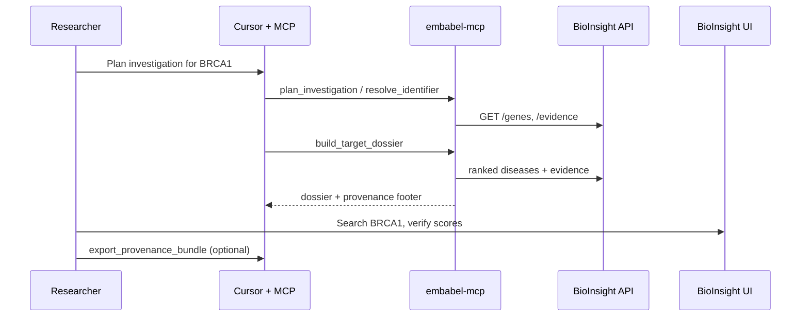

# MCP demo flow (M10)

Human-in-the-loop workflow: **Cursor → MCP dossier → BioInsight UI verify**.

## Prerequisites

1. [bioinsight-graph](https://github.com/LordKay-sudo/bioinsight-graph) running (`docker compose up --build`)
2. [embabel-mcp](https://github.com/LordKay-sudo/embabel-mcp) running on http://localhost:1337/sse
3. Cursor configured with `mcp-remote` → embabel SSE endpoint

## Demo script

1. In Cursor, connect to the **bioinsight-graph** MCP server.
2. Ask: *"Plan an investigation for BRCA1, then build a target dossier."*
   - Tools: `plan_investigation` → `resolve_identifier` → `build_target_dossier`
3. Open http://localhost:8080 — search **BRCA1**, compare top disease scores with the dossier.
4. Optional: `export_provenance_bundle` or `export_gene_report` for an auditable handoff.
5. Use MCP prompt **`review-gene-report`** for explicit HITL review steps.

## Visual assets

- BioInsight UI walkthrough GIF (search → BRCA1 → graph): [demo-walkthrough.gif](https://github.com/LordKay-sudo/bioinsight-graph/blob/main/docs/demo-walkthrough.gif)
- UI gallery (compare + disease pages): [bioinsight-graph README](https://github.com/LordKay-sudo/bioinsight-graph#ui-gallery)
- Refresh when UI changes: `node scripts/capture_media.mjs` in bioinsight-graph (stack on `:8080`)

### End-to-end flow (M10)

Recording a Cursor session GIF is optional; the BioInsight UI GIF above covers the **verify in UI** step.

## Ops logging (M12)

Set `BIOINSIGHT_MCP_METRICS_LOG_LEVEL=DEBUG` (default) to log per-response `tool_profile`, char count, and approximate tokens under logger `bioinsight.mcp.metrics`.
